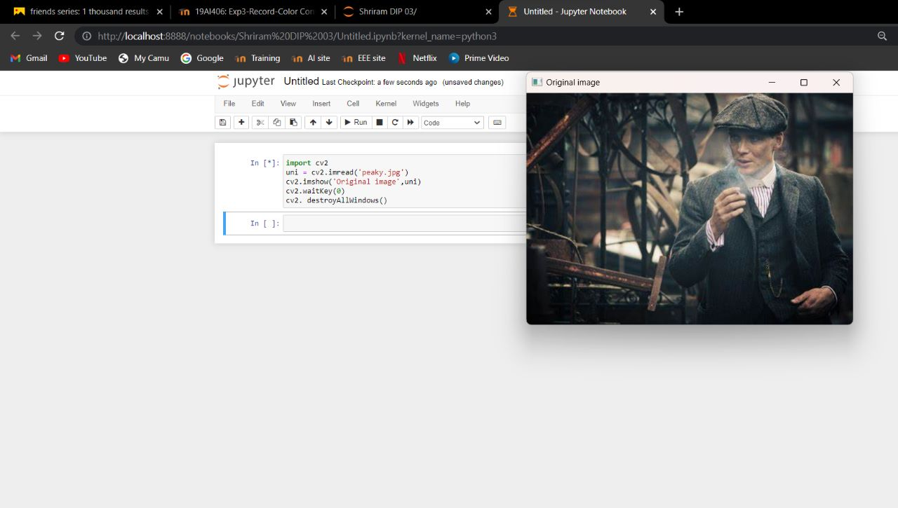
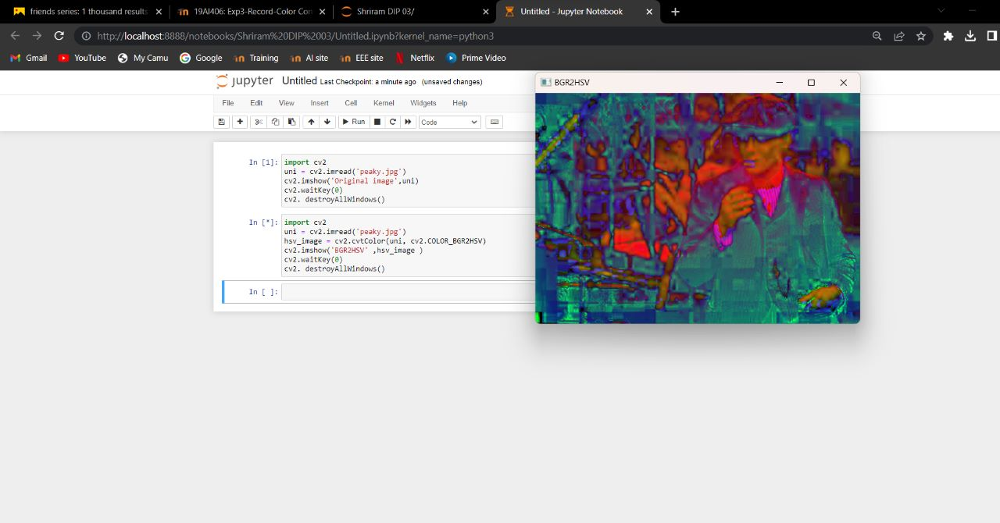
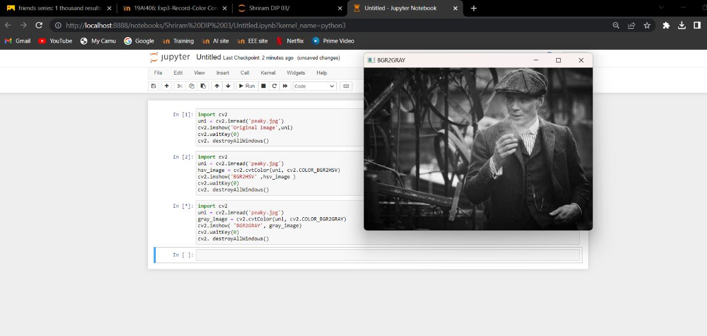
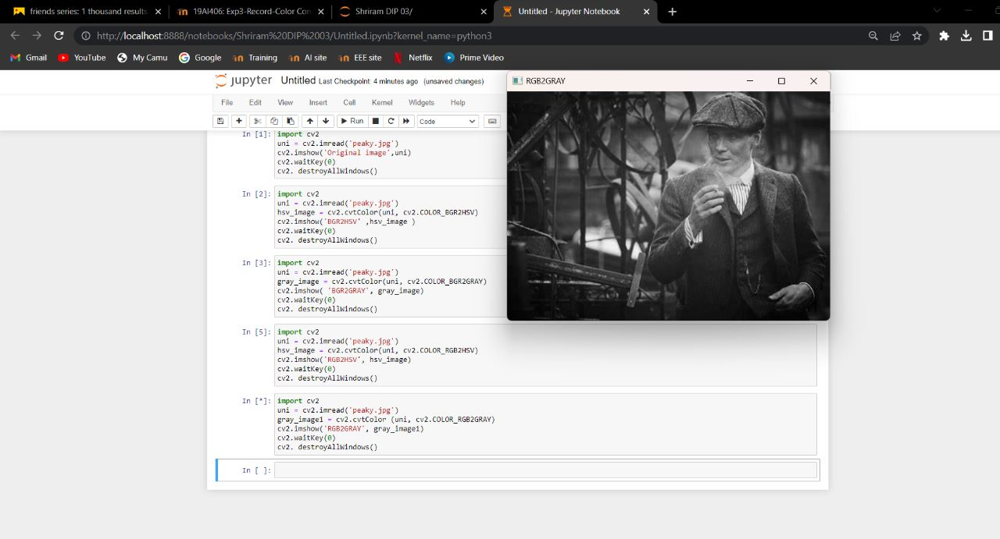
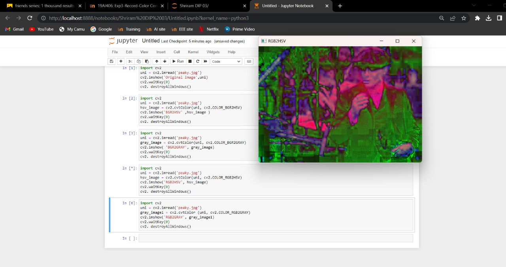
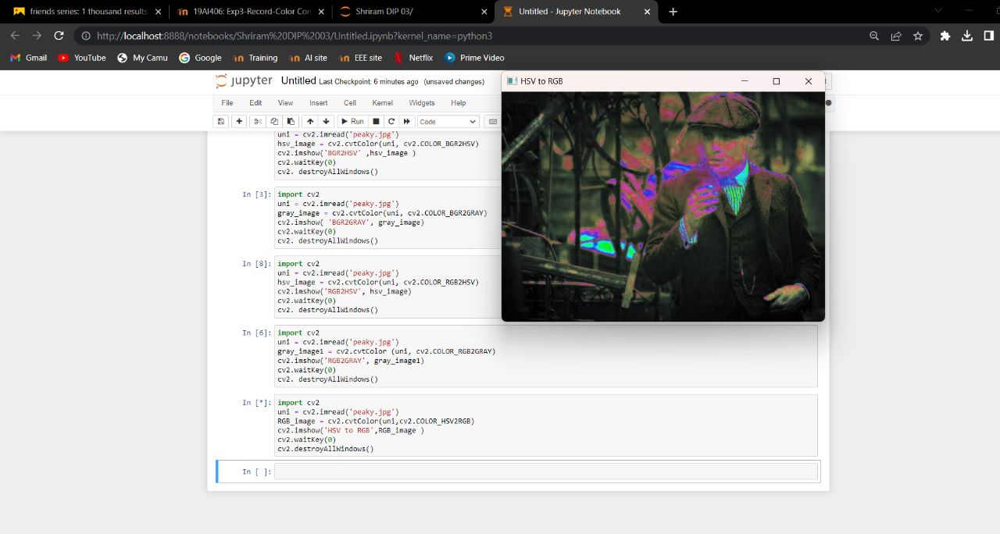
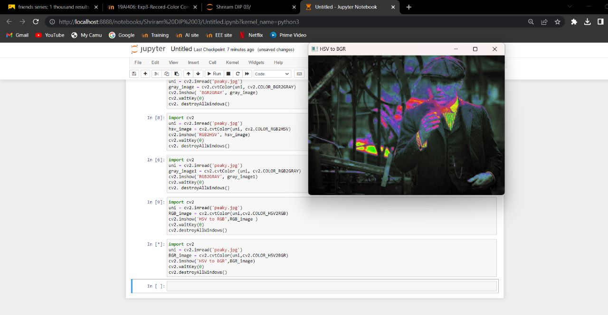
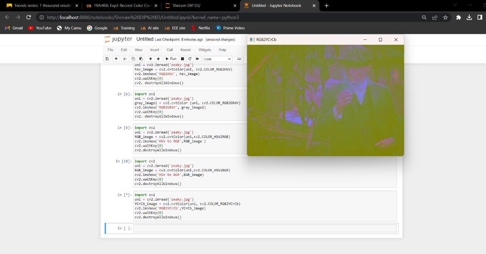
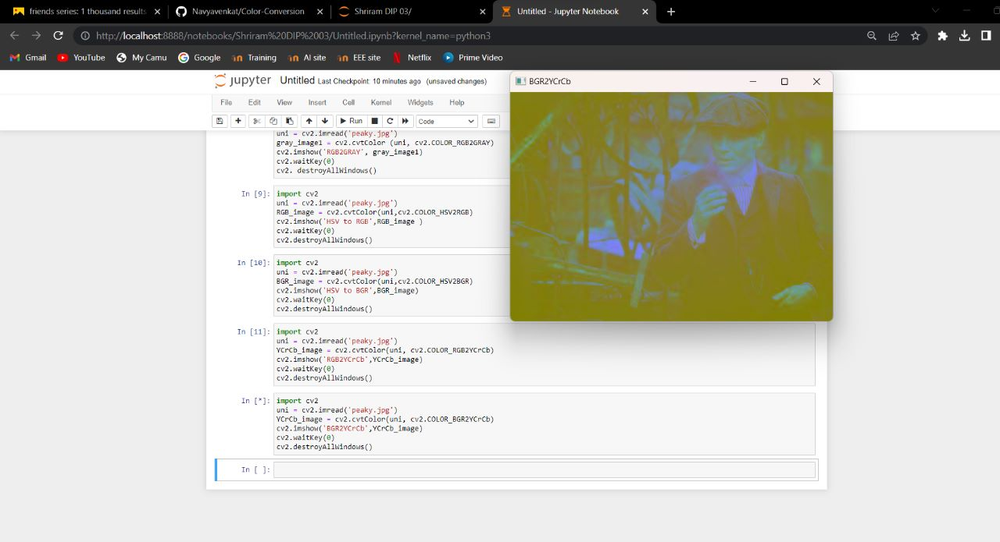
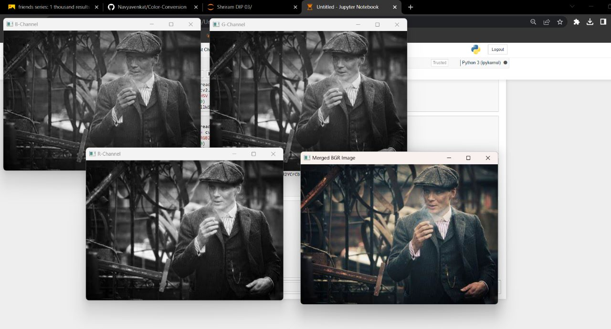

# COLOUR-CONVERSION
## AIM:
To perform the color conversion between RGB, BGR, HSV, and YCbCr color models.

## SOFTWARE REQUIRED:
Anaconda - Python 3.7
## ALGORITHM:
### Step1:
Import cv2 and save and image as filename.png

### Step2:
Use imread(filename, flags) to read the file

### Step3:
Use cv2.cvtColor(src, code, dst, dstCn) to convert an image from one color space to another.

### Step4:
Split and merge the image using cv2.split and cv2.merge commands.

### Step5:
End the program and close the output image windows.

## PROGRAM:

Developed By : Shriram R

Register Number : 212221240053
~~~
i) Original Image

import cv2
uni = cv2.imread('peaky.jpg')
cv2.imshow('Original image',uni)
cv2.waitKey(0)
cv2. destroyAllWindows()

ii) Convert BGR to HSV 

import cv2
uni = cv2.imread('peaky.jpg')
hsv_image = cv2.cvtColor(uni, cv2.COLOR_BGR2HSV)
cv2.imshow('BGR2HSV' ,hsv_image )
cv2.waitKey(0)
cv2. destroyAllWindows()

iii)Convert BGR to GRAY

import cv2
uni = cv2.imread('peaky.jpg')
gray_image = cv2.cvtColor(uni, cv2.COLOR_BGR2GRAY)
cv2.imshow( 'BGR2GRAY', gray_image)
cv2.waitKey(0)
cv2. destroyAllWindows()

iv) Convert RGB to HSV

import cv2
uni = cv2.imread('peaky.jpg')
hsv_image = cv2.cvtColor(uni, cv2.COLOR_RGB2HSV)
cv2.imshow('RGB2HSV', hsv_image)
cv2.waitKey(0)
cv2. destroyAllWindows()

v)  Convert RGB to GRAY

import cv2
uni = cv2.imread('peaky.jpg')
gray_image1 = cv2.cvtColor (uni, cv2.COLOR_RGB2GRAY)
cv2.imshow('RGB2GRAY', gray_image1)
cv2.waitKey(0)
cv2. destroyAllWindows()

vi) Convert HSV to RGB

import cv2
uni = cv2.imread('peaky.jpg')
RGB_image = cv2.cvtColor(uni,cv2.COLOR_HSV2RGB)
cv2.imshow('HSV to RGB',RGB_image )
cv2.waitKey(0)
cv2.destroyAllWindows()

vii)  Convert HSV to BGR

import cv2
uni = cv2.imread('peaky.jpg')
BGR_image = cv2.cvtColor(uni,cv2.COLOR_HSV2BGR)
cv2.imshow('HSV to BGR',BGR_image)
cv2.waitKey(0)
cv2.destroyAllWindows()

viii)  Convert RGB to YCrCb

import cv2
uni = cv2.imread('peaky.jpg')
YCrCb_image = cv2.cvtColor(uni, cv2.COLOR_RGB2YCrCb)
cv2.imshow('RGB2YCrCb',YCrCb_image)
cv2.waitKey(0)
cv2.destroyAllWindows()

ix) Convert BGR to YCrCb

import cv2
uni = cv2.imread('peaky.jpg')
YCrCb_image = cv2.cvtColor(uni, cv2.COLOR_BGR2YCrCb)
cv2.imshow('BGR2YCrCb',YCrCb_image)
cv2.waitKey(0)
cv2.destroyAllWindows()

x) Merge RGB Image

import cv2
uni = cv2.imread('peaky.jpg')
blue=uni[:,:,0]
green=uni[:,:,1]
red=uni[:,:,2]
cv2.imshow('B-Channel',blue)
cv2.imshow('G-Channel',green)
cv2.imshow('R-Channel',red)

merged_BGR=cv2.merge((blue,green,red))
cv2.imshow('Merged BGR Image',merged_BGR)
cv2.waitKey(0)
cv2.destoryAllWindows()

xi) Split HSV Image

import cv2
uni = cv2.imread('peaky.jpg')
hsv=cv2.cvtColor(uni,cv2.COLOR_BGR2HSV)
h,s,v=cv2.split(hsv)
cv2.imshow("Hue-image",h)
cv2.imshow("Saturation-image",s)
cv2.imshow("gray-image",v)

xii) Merge HSV Image

Merged_HSV=cv2.merge((h,s,v))
cv2.imshow('Merged HSV Image',Merged_HSV)
cv2.waitKey(0)
cv2.destoryAllWindows()
~~~
## OUTPUT:
### i) Original Image

### ii) Convert BGR to HSV

### iii)Convert BGR to GRAY

### iv) Convert RGB to HSV

### v) Convert RGB to GRAY

### vi) Convert HSV to RGB

### vii) Convert HSV to BGR

### viii) Convert RGB to YCrCb

### ix) Convert BGR to YCrCb

### x) Merge RGB Image

## RESULT:
Thus the color conversion was performed between RGB, HSV and YCbCr color models.